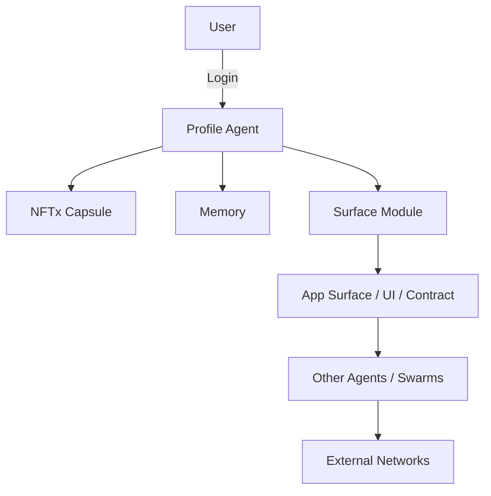

# FRAME Protocol

> A Sovereign Operating Framework for the Internet of Intelligence

## Overview
FRAME is an open protocol and sovereign system architecture for the emerging machine-driven internet. It defines a universal structure for building decentralized, AI-powered digital societies where programmable identity, logic, economy, and memory converge.

FRAME is not a product — it is a foundational architecture. It defines how intelligent agents interact with users, apps, assets, and each other. It formalizes control surfaces between AI cognition, economic logic, and cryptographic authority.

Join us in shaping the post-human digital operating system:
👉 https://discord.gg/k7K4FwQpyf

---

## Core Concepts

### 🧠 AI-Native Profiles
Every FRAME identity is a programmable, sovereign agent. Users instantiate "Profiles" that embed:
- Cryptographic keys
- AI Co-Agents
- Logic modules
- Memory and experience

Profiles can evolve, learn, and autonomously act. Each Profile is a sovereign intelligence hub, not just a static wallet or address.

### 📦 NFTx State Capsules
FRAME introduces NFTx — a standard for dynamic state containers:
- Store logic, preferences, and agent state
- Move across chains and systems
- Signed, versioned, and hash-linked

Everything in FRAME flows through NFTx capsules — identity, code, experience, and economic state.

### 🧰 Modular Operating Surfaces
FRAME applications are not apps — they are surfaces. These modular interaction layers include:
- Logic (smart contracts, agents)
- UI schema (custom views)
- AI plugin interfaces
- Message/event buses

Agents and users can attach, detach, and route between surfaces dynamically.

### ⚖️ Dual Token Economy
FRAME supports:
- $FRAME — governance + gas
- $CHAT — programmable utility & AI credits

Both tokens operate with game-theoretic models to:
- Prevent spam
- Reward computation
- Sustain ecosystem coordination

### 🛰️ Agent Swarms
FRAME enables collaborative intelligence:
- Agents cluster into swarms for tasks
- Swarms operate as DAOs or federations
- Each swarm is a living protocol

---

## Architecture

---

## Development Goals
- Fully modular, chain-agnostic design
- Real-time logic surfaces and AI plugin compatibility
- Persistent semantic memory + audit trail
- Permissionless protocol-level extensibility

---

## Status
FRAME is in active development. First primitives include:
- ✅ Identity profiles with AI co-agents
- ✅ Discord integration for live intelligence coordination
- 🔄 NFTx dynamic capsule spec
- 🔄 Chain abstraction layer (multi-chain identity + logic)
- 🔄 Agent swarm protocol

---

## Links
- 🌐 Main Site: *coming soon*
- 🤖 Discord: [Join FRAME](https://discord.gg/k7K4FwQpyf)

---

## License
MIT License — see `LICENSE.md`

> FRAME is a vision protocol — a reference operating structure for digital sovereignty. It belongs to no one. It evolves through logic, not authority.
