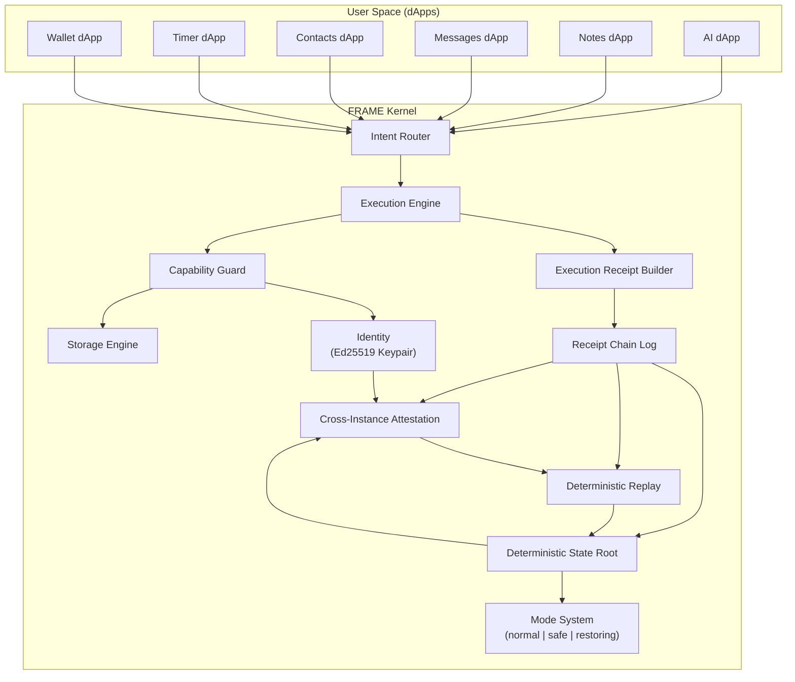
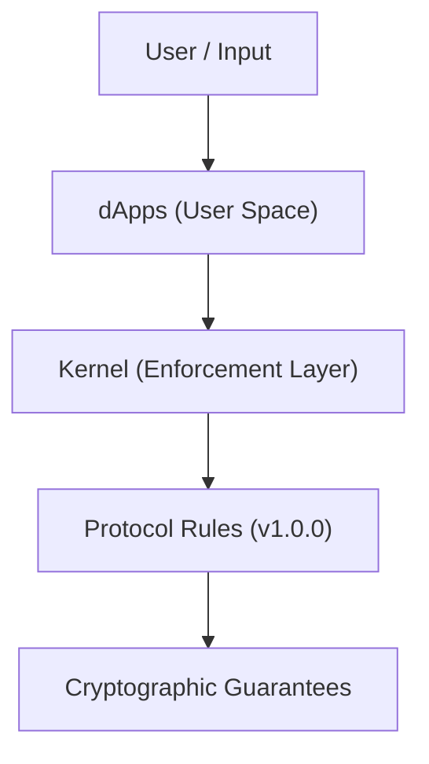

# FRAME Protocol

> A Sovereign Operating Framework for the Internet of Intelligence

## Overview
FRAME is an open protocol and sovereign system architecture for the emerging machine-driven internet. It defines a universal structure for building decentralized, AI-powered digital societies where programmable identity, logic, economy, and memory converge.

FRAME is not a product, it is a foundational architecture. It defines how dapps interact with AI agents, users, dapps, assets, and each other. It formalizes control surfaces between AI cognition, economic logic, and cryptographic authority.

Join in shaping the post-human digital operating system:
👉 https://discord.gg/k7K4FwQpyf

---
Most software today depends on centralized servers.
Your identity lives on someone else’s infrastructure.
Your data is stored remotely.
Your permissions are enforced by platforms you don’t control.

FRAME exists to invert that model.

FRAME is a local-first identity runtime.

It runs modular dApps inside a controlled execution environment bound to a cryptographic identity stored on your machine.

Each app declares the capabilities it needs.
FRAME enforces those permissions at runtime.

Every action is recorded in a signed, hash-linked log.
The system state can be derived and verified deterministically.

There is no backend service.
No external account system.
No platform-level trust assumption.

Identity, execution, storage, and integrity are unified locally.

---

## Architecture

```mermaid
flowchart TB

%% =========================
%% USER SPACE (dApps)
%% =========================

subgraph USER_SPACE["User Space (dApps)"]
    AI["AI dApp"]
    NOTES["Notes dApp"]
    MESSAGES["Messages dApp"]
    CONTACTS["Contacts dApp"]
    TIMER["Timer dApp"]
    WALLET["Wallet dApp"]
end

%% =========================
%% KERNEL
%% =========================

subgraph KERNEL["FRAME Kernel"]

    ROUTER["Intent Router"]
    ENGINE["Execution Engine"]
    GUARD["Capability Guard"]
    MODE["Mode System\n(normal | safe | restoring)"]
    STORAGE["Storage Engine"]
    IDENTITY["Identity\n(Ed25519 Keypair)"]
    RECEIPT["Execution Receipt Builder"]
    CHAIN["Receipt Chain Log"]
    STATE_ROOT["Deterministic State Root"]
    REPLAY["Deterministic Replay"]
    ATTEST["Cross-Instance Attestation"]

end

%% =========================
%% FLOW: EXECUTION
%% =========================

AI --> ROUTER
NOTES --> ROUTER
MESSAGES --> ROUTER
CONTACTS --> ROUTER
TIMER --> ROUTER
WALLET --> ROUTER

ROUTER --> ENGINE
ENGINE --> GUARD
GUARD --> STORAGE
GUARD --> IDENTITY

ENGINE --> RECEIPT
RECEIPT --> CHAIN
CHAIN --> STATE_ROOT

STATE_ROOT --> MODE

%% =========================
%% REPLAY / VERIFICATION
%% =========================

CHAIN --> REPLAY
REPLAY --> STATE_ROOT
CHAIN --> ATTEST
ATTEST --> REPLAY

%% =========================
%% EXPORT / IMPORT
%% =========================

IDENTITY --> ATTEST
STATE_ROOT --> ATTEST
```
### Protocol layers

```mermaid
flowchart TB

USER["User / Input"]
DAPPS["dApps (User Space)"]
KERNEL["Kernel (Enforcement Layer)"]
PROTOCOL["Protocol Rules (v1.0.0)"]
CRYPTO["Cryptographic Guarantees"]

USER --> DAPPS
DAPPS --> KERNEL
KERNEL --> PROTOCOL
PROTOCOL --> CRYPTO
```
---

## Development Goals
# FRAME Master Completion Checklist

## Phase 0 --- Deterministic Kernel (COMPLETE)

-   [x] Ed25519 root identity (Vault model)
-   [x] Signed receipt chain
-   [x] Canonical JSON serialization defined and frozen
-   [x] Strict JSON-only storage enforcement
-   [x] Safe integer-only number enforcement
-   [x] Circular reference rejection
-   [x] Prototype pollution protection
-   [x] Frozen CAPABILITY_SCHEMA v1
-   [x] Capability subset enforcement
-   [x] Code hash binding for all installed dApps
-   [x] State root versioning discipline
-   [x] Receipt versioning discipline
-   [x] Protocol versioning discipline
-   [x] Deterministic state root computation
-   [x] Boot-time invariant enforcement
-   [x] Safe mode latch on integrity failure
-   [x] Deterministic sandbox injection (Date override)
-   [x] Deterministic sandbox injection (Math.random seeded)
-   [x] Async APIs blocked (setTimeout, fetch, etc.)
-   [x] Promise-return detection and rejection
-   [x] Authoritative reconstruction mode
-   [x] Full state reconstruction from receipts
-   [x] Reconstruction verification at boot
-   [x] Receipt continuity verification
-   [x] inputPayload stored in receipts (v2)
-   [x] inputHash verified against canonical payload
-   [x] Deterministic replay stability check
-   [x] Rolling receipt chain commitment

## Phase 1 --- dApp System (COMPLETE)

-   [x] dApp manifest structure
-   [x] Capability-declared execution
-   [x] Scoped API injection
-   [x] No privileged internal dApp access
-   [x] All system features implemented as dApps (AI included)
-   [x] Deterministic execution isolation
-   [x] dApp preview() interface
-   [x] Router-based execution model
-   [x] Router-based preview broadcast
-   [x] AI classifier integration for previews
-   [x] AI + preview confidence merging
-   [x] Debounced live intent preview UI
-   [x] Inline preview cards
-   [x] Click-to-execute preview actions

## Phase 2 --- Intent Orchestration (IN PROGRESS)

-   [ ] Structured multi-step intent objects
-   [ ] Composite intent preview cards
-   [ ] AI-generated multi-dApp execution plans
-   [ ] Conditional execution previews
-   [ ] Parameter extraction for complex intents
-   [ ] Execution graph visualization

## Phase 3 --- Execution Environment Hardening (PARTIAL)

-   [x] Async blocked
-   [x] External I/O blocked by default
-   [ ] Explicit deterministic execution constraints documentation
-   [ ] Formal state transition function written (spec-level)
-   [ ] Execution guarantees documented clearly
-   [ ] Sandbox escape analysis audit

## Phase 4 --- Controlled External Capabilities (NOT STARTED)

-   [ ] network.request capability
-   [ ] Deterministic logging of network responses
-   [ ] Mesh networking capability (WiFi/Bluetooth)
-   [ ] Peer-to-peer communication layer
-   [ ] External capability boundary model
-   [ ] Nondeterministic input sealing strategy
-   [ ] Receipt inclusion of external data preimages

## Phase 5 --- AI-First Operating Environment (EARLY STAGE)

-   [x] AI as catch-all fallback
-   [x] AI classifier for structured intent
-   [ ] AI intent composition engine
-   [ ] AI memory dApp integration
-   [ ] Context-aware AI ranking across dApps
-   [ ] AI tool chaining engine
-   [ ] Cross-dApp reasoning support

## Phase 6 --- Vault / Identity Layer Expansion (OPTIONAL)

-   [x] Single-root sovereign Vault
-   [ ] Multi-sig Vault abstraction
-   [ ] Delegated execution model
-   [ ] Policy-based signature verification
-   [ ] Organizational Vault model
-   [ ] Device-linked subkeys

## Phase 7 --- Performance & Scalability

-   [ ] Merkle-based receipt commitment optimization
-   [ ] Incremental stateRoot caching
-   [ ] Lazy reconstruction option
-   [ ] Snapshot export/import optimization
-   [ ] Large receipt chain performance testing

## Phase 8 --- Formalization

-   [ ] Full protocol specification document
-   [ ] State transition formal definition
-   [ ] Receipt format spec v2.0.0
-   [ ] Canonicalization formal spec
-   [ ] Deterministic sandbox specification
-   [ ] Security model document
-   [ ] Threat model analysis
-   [ ] Migration guide between protocol versions

## Phase 9 --- Product Completion

-   [ ] Human-readable receipt explorer
-   [ ] Visual state root inspector
-   [ ] Vault management UI polish
-   [ ] Capability permission UI
-   [ ] dApp store / installer UX
-   [ ] Error clarity and developer diagnostics
-   [ ] Mobile form factor support

## Definition of Fully Complete

FRAME can be considered fully complete when:

-   Deterministic kernel is frozen
-   Intent composition is implemented
-   External capability model is finalized
-   Formal protocol specification is written
-   Vault export/import is stable
-   Security model is documented
-   Execution environment is provably sealed
-   AI orchestration is stable and composable

---

## License
MIT License — see `LICENSE.md`

> FRAME is a vision protocol — a reference operating structure for digital sovereignty. It belongs to no one. It evolves through logic, not authority.
