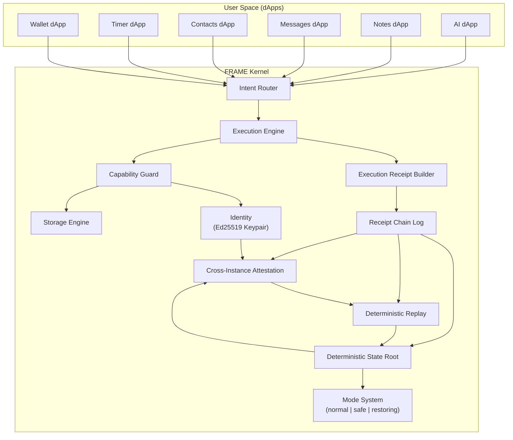
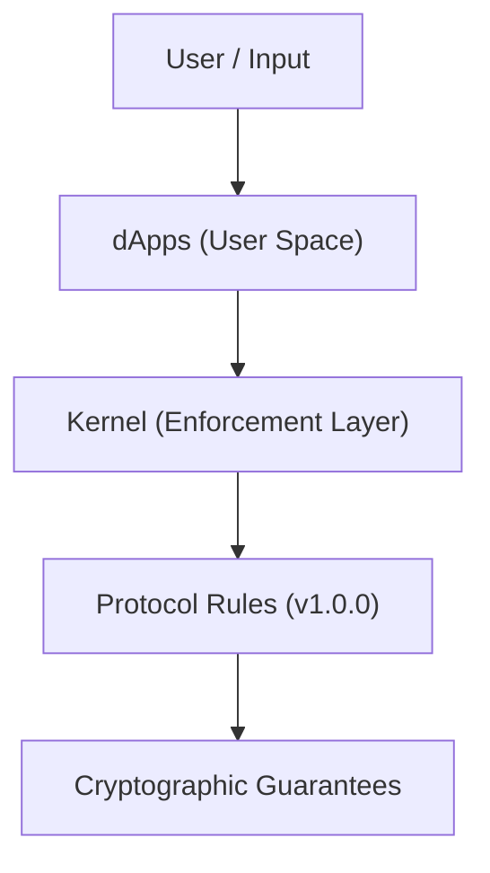

# FRAME

> Frame combines instant, verifiable app execution, optional blockchain settlement, and full user-level customization, making decentralized apps practical, flexible, and accessible without forcing people to understand the underlying technical complexity.

## About

Is a system that lets people run apps and make agreements directly on their own device while keeping a signed, tamper resistant history of everything that happens, so instead of relying on trusting a company’s algorithm to decide what’s true, you can verify it yourself at any time; payments, contracts, rides, or marketplace deals can happen instantly inside Frame using its own internal monetary system, even offline, and every action is recorded in a way that can be verified. 

This matters today because most digital services are controlled by centralized platforms that can change rules, freeze accounts, limit what you can build, or lock you into rigid designs, while blockchains are powerful for ownership and global value transfer are often too slow, expensive, and complicated for everyday app interactions. 

Frame bridges that gap by handling fast, realtime activity locally so apps feel smooth and immediate, while still using blockchains alongside it as external verification when real world value needs to move in or out. On top of that, Frame includes AI-powered apps that can help you create your own apps, design your own layout, and customize how everything looks and behaves, meaning you’re not stuck with fixed interfaces given current platforms.

---

# Say Bye To:
* passwords
* multiple email accounts
* two factor auth
* required updates
* multiple email accounts
* account lockouts
* platform bans controlling your data
* “forgot password” loops
* centralized data silos
* proprietary algorithms
* forced app redesigns you didn’t ask for
* losing access because a company shuts down
* being locked into one device
* losing purchase history when switching platforms
* opaque transaction histories
* waiting for slow blockchain confirmations just to use an app
* handing over personal data just to create an account
* one-size-fits-all app interfaces
* needing separate wallets for every crypto app

---

Join in shaping the post-human digital operating system:
👉 https://discord.gg/k7K4FwQpyf

---

Most software today depends on centralized servers.
Your identity lives on someone else’s infrastructure.
Your data is stored remotely.
Your permissions are enforced by platforms you don’t control.

FRAME exists to invert that model.

FRAME is a local-first identity runtime.

It runs modular dApps inside a controlled execution environment bound to a cryptographic identity stored on your machine.

Each app declares the capabilities it needs.
FRAME enforces those permissions at runtime.

Every action is recorded in a signed, hash-linked log.
The system state can be derived and verified deterministically.

There is no backend service.
No external account system.
No platform-level trust assumption.

Identity, execution, storage, and integrity are unified locally.

---

## Architecture

```mermaid
flowchart TB

%% =========================
%% USER SPACE (dApps)
%% =========================

subgraph USER_SPACE["User Space (dApps)"]
    AI["AI dApp"]
    NOTES["Notes dApp"]
    MESSAGES["Messages dApp"]
    CONTACTS["Contacts dApp"]
    TIMER["Timer dApp"]
    WALLET["Wallet dApp"]
end

%% =========================
%% KERNEL
%% =========================

subgraph KERNEL["FRAME Kernel"]

    ROUTER["Intent Router"]
    ENGINE["Execution Engine"]
    GUARD["Capability Guard"]
    MODE["Mode System\n(normal | safe | restoring)"]
    STORAGE["Storage Engine"]
    IDENTITY["Identity\n(Ed25519 Keypair)"]
    RECEIPT["Execution Receipt Builder"]
    CHAIN["Receipt Chain Log"]
    STATE_ROOT["Deterministic State Root"]
    REPLAY["Deterministic Replay"]
    ATTEST["Cross-Instance Attestation"]

end

%% =========================
%% FLOW: EXECUTION
%% =========================

AI --> ROUTER
NOTES --> ROUTER
MESSAGES --> ROUTER
CONTACTS --> ROUTER
TIMER --> ROUTER
WALLET --> ROUTER

ROUTER --> ENGINE
ENGINE --> GUARD
GUARD --> STORAGE
GUARD --> IDENTITY

ENGINE --> RECEIPT
RECEIPT --> CHAIN
CHAIN --> STATE_ROOT

STATE_ROOT --> MODE

%% =========================
%% REPLAY / VERIFICATION
%% =========================

CHAIN --> REPLAY
REPLAY --> STATE_ROOT
CHAIN --> ATTEST
ATTEST --> REPLAY

%% =========================
%% EXPORT / IMPORT
%% =========================

IDENTITY --> ATTEST
STATE_ROOT --> ATTEST
```
### Protocol layers

```mermaid
flowchart TB

USER["User / Input"]
DAPPS["dApps (User Space)"]
KERNEL["Kernel (Enforcement Layer)"]
PROTOCOL["Protocol Rules (v1.0.0)"]
CRYPTO["Cryptographic Guarantees"]

USER --> DAPPS
DAPPS --> KERNEL
KERNEL --> PROTOCOL
PROTOCOL --> CRYPTO
```
---

## License
MIT License — see `LICENSE.md`

> FRAME is a vision protocol — a reference operating structure for digital sovereignty. It belongs to no one. It evolves through logic, not authority.
