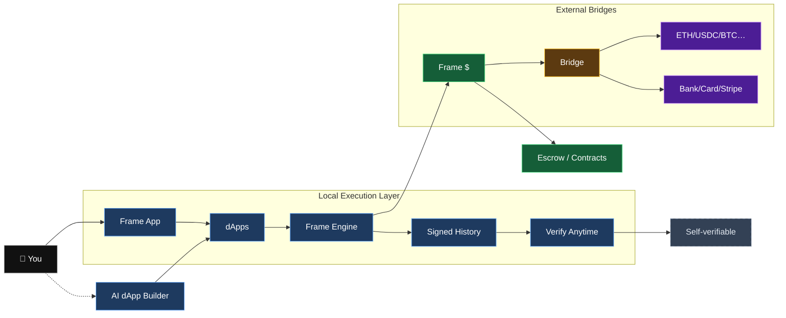

# FRAME
> [!IMPORTANT]
> The latest repo isn't on github yet. 
> The other repos on this github lack multiple functions but show part of the spine

> Frame combines instant, verifiable app execution, optional blockchain settlement, and full user-level customization, making decentralized apps practical, flexible, and accessible without forcing people to understand the underlying technical complexity.

## About

Is a system that lets people run apps and make agreements directly on their own device while keeping a signed, tamper resistant history of everything that happens, so instead of relying on trusting a company’s algorithm to decide what’s true, you can verify it yourself at any time; payments, contracts, rides, or marketplace deals can happen instantly inside Frame using its own internal monetary system, even offline, and every action is recorded in a way that can be verified. 

This matters today because most digital services are controlled by centralized platforms that can change rules, freeze accounts, limit what you can build, or lock you into rigid designs, while blockchains are powerful for ownership and global value transfer are often too slow, expensive, and complicated for everyday app interactions. 

Frame bridges that gap by handling fast, realtime activity locally so apps feel smooth and immediate, while still using blockchains alongside it as external verification when real world value needs to move in or out. On top of that, Frame includes AI-powered apps that can help you create your own apps, design your own layout, and customize how everything looks and behaves, meaning you’re not stuck with fixed interfaces given current platforms.

| 👋 bye to:                                                     | 🤗 hello to:                                                               |
|----------------------------------------------------------------|----------------------------------------------------------------------------|
| Passwords                                                      | Owning your own data                                                       |
| Multiple email accounts                                        | Pick and choose what specific data you share with what app & who           |
| Two-factor auth (annoying 2FA prompts)                         | Easily make your own apps                                                  |
| Required updates (forced reboots & changes)                    | Modify others' apps on your own device                                     |
| Account lockouts                                               | Make your apps function how you want                                       |
| Platform bans controlling your data                            | Make your own blockchains (or personal chains/sub-chains)                  |
| “Forgot password” loops                                        | Being in control digitally                                                 |
| Centralized data silos                                         | Seeing proof and verifiable evidence of everything                         |
| Proprietary algorithms (black-box decisions)                   | Transparent, auditable logic you can inspect and replay anytime            |
| Forced app redesigns you didn’t ask for                        | Customize interfaces and features to fit your exact needs                  |
| Losing access because a company shuts down                     | True portability, switch devices or platforms without losing anything      |
| Being locked into one device                                   | Seamless access across your devices with full ownership                    |
| Losing purchase history when switching platforms               | Permanent, tamper-resistant transaction & history logs you control         |
| Opaque transaction histories                                   | Crystal-clear, self-verifiable records of every action and payment         |
| Waiting for slow blockchain confirmations just to use an app   | Instant local execution for everyday actions (bridge only when needed)     |
| Handing over personal data just to create an account           | Zero-knowledge or selective disclosure share proofs, not raw data          |
| One-size-fits-all app interfaces                               | Personalized, AI-assisted interfaces built or remixed by you               |
| Needing separate wallets for every crypto app                  | Unified, local-first wallet/engine handling everything seamlessly          |
| Not owning your own data                                       | your data, your rules, your proofs forever                                 |

---

## How it works (Simple)

```mermaid
flowchart LR
    U[👤 You] --> UI[Frame App]

    subgraph "Local Execution Layer"
        UI --> DAPP[dApps]
        DAPP --> ENGINE[Frame Engine]
        ENGINE --> LEDGER[Signed History]
        LEDGER --> VERIFY[Verify Anytime]
    end

    ENGINE --> FC[Frame $]
    FC --> ESCROW[Escrow / Contracts]

    subgraph "External Bridges"
        FC  --> BRIDGE[Bridge]
        BRIDGE --> BLOCKCHAIN[ETH/USDC/BTC…]
        BRIDGE --> FIAT[Bank/Card/Stripe]
    end

    U -.-> AI[AI dApp Builder] --> DAPP
    VERIFY --> TRUST[Self-verifiable]

    classDef user fill:#111,stroke:#ccc,color:#fff
    classDef local fill:#1e3a5f,stroke:#60a5fa,color:#fff
    classDef value fill:#155e38,stroke:#4ade80,color:#fff
    classDef bridge fill:#5c3a10,stroke:#fbbf24,color:#fff
    classDef external fill:#4c1d95,stroke:#c084fc,color:#fff
    classDef trust fill:#334155,stroke:#94a3b8,color:#e2e8f0,stroke-dasharray: 5 5

    class U user
    class UI,DAPP,ENGINE,LEDGER,VERIFY,AI local
    class FC,ESCROW value
    class BRIDGE bridge
    class BLOCKCHAIN,FIAT external
    class TRUST trust
```
---

Most software today depends on centralized servers.
Your identity lives on someone else’s infrastructure.
Your data is stored remotely.
Your permissions are enforced by platforms you don’t control.

FRAME is a local-first identity runtime.

*It runs modular dApps inside a controlled execution environment bound to a cryptographic identity stored on your machine. Each app declares the capabilities it needs. FRAME enforces those permissions at runtime. Every action is recorded in a signed, hash-linked log. The system state can be derived and verified deterministically. Identity, execution, storage, and integrity are unified locally.*

---

## Core Resources

- **[Protocol Specification](./SPEC.md)**  
  Formal definition of the Frame runtime: deterministic state transition rules, signed receipt chain, replay-based verification, internal FC settlement model with strict 1:1 bridge backing, federation sync policy, and upgrade/version discipline.

- **[System Architecture](./docs/architecture.md)**  
  Layered design of the Frame stack: local execution engine, receipt-sealed ledger, contract and escrow layer, FC settlement unit, and bridge boundary to external payment systems (blockchains and fiat rails). Includes execution and value flow diagrams.

- **[Integrity & Threat Model](./THREAT_MODEL.md)**  
  Explicit trust boundaries and attack analysis covering storage tampering, bridge fraud, federation conflicts, malicious dApps, and replay integrity. Defines what Frame protects against and what it does not.

- **[Development Roadmap](./ROADMAP.md)**  
  Structured evolution plan: deterministic kernel completion, economic layer formalization (FC + escrow + bridge), snapshot and federation hardening, performance scaling, developer tooling, real bridge integrations, and ecosystem expansion.

## **[10 Papers](./PAPERS.md)**  

- **List:**  
  Deterministic State Transition and Receipt Chain Architecture, Canonical Serialization and Replay-Based Verification Model, Capability-Gated dApp Isolation and Execution Sandboxing, Formal State Root Computation and Versioning Discipline, Deterministic Multi-Party Contract and Escrow Framework, Internal Settlement Token Design and Supply Integrity Model, 1:1 Backed Bridge Protocol for External Asset Integration, Federation and Cross-Instance Deterministic Chain Synchronization, Snapshot Migration and Stateful Instance Portability Protocol, AI-Orchestrated Structured Intent Composition in Deterministic Runtimes

---

Join in shaping the post-human digital operating system:
👉 https://discord.gg/k7K4FwQpyf

## License
MIT License — see `LICENSE.md`

> FRAME is a vision protocol — a reference operating structure for digital sovereignty. It belongs to no one. It evolves through logic, not authority.
