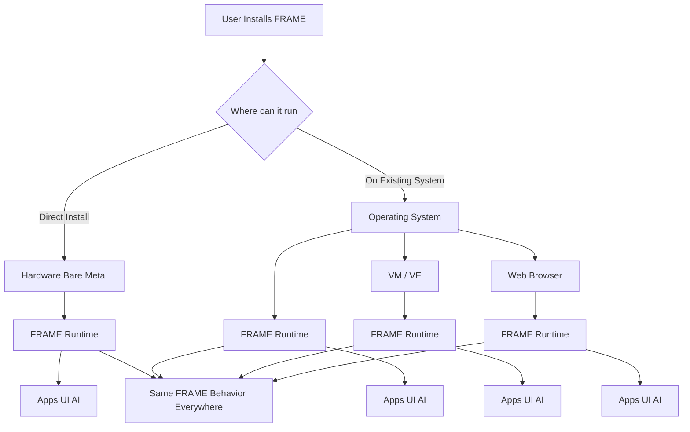

<h1 align="center">
  <sub>
    <sup>
      <sub>
        <h1 align="center" style="font-size: 10rem;">Frame</h1>
      </sub>
    </sup>
  </sub>
</h1>
Whats Frame?
<p align="center">select an AI to explain & ask questions</p>
<p align="center">
  <a href="https://www.google.com/" target="_blank">
    
  </a>
  &nbsp;&nbsp;
  &nbsp;&nbsp;
  <a href="https://www.google.com" target="_blank">
    
  </a>
</p>

<!-- update both linked images to use a frame dapp governed public asset export layer with selective exposure  -->


---

> [!NOTE]
> **Sovereign Deterministic Operating System for Autonomous AI Runtime Orchestration**
>
> ### User interface: Dynamic automatic self generating real time TUI
>
> ---
>
> `hardware agnostic autonomous artificial intelligence native execution layer capable of operating across multiple abstraction boundaries including baremetal deployment kernel level integration userspace runtime atop Linux standalone runtime analogous to Nodejs or browser based sandbox environments spanning servers laptops edge devices vehicles robots and distributed machines replacing traditional application and operating system paradigms with a self evolving self modifying adaptive deterministic local first sovereign runtime and operating system featuring artificial intelligence assisted intent compilation and symbol token execution user interface state driven constrained reasoning that dynamically shapes model behavior modular dApp architecture with capability based security and isolated execution a verifiable computation pipeline producing signed receipts hash linked chains and execution envelopes multinode quorum validation with replayable and auditable state history composable state packaging for branching diffing merging rollback and fullstate version control a programmable builder enabling selective inclusion of applications execution history state permissions drivers models and currency permission gated installation with reversible applications and localfirst marketplace distribution identityanchored cryptographic authorship and signature verification without centralized authority an integrated value layer via simulated and real blockchain backed currency tied to execution provenance and a fully programmable agent driven interface in which AI and UI cocontrol each other to orchestrate deterministic trustless portable and shareable computation across users identities devices and nodes`

---


```mermaid
flowchart TB

    %% Entry point
    U[User Installs FRAME] --> CH{Where can it run}

    %% Bare metal path
    CH -->|Direct Install| BM[Hardware Bare Metal]
    BM --> RT1[FRAME Runtime]
    RT1 --> APPS1[Apps UI AI]

    %% OS path
    CH -->|On Existing System| OS[Operating System]
    OS --> RT2[FRAME Runtime]
    RT2 --> APPS2[Apps UI AI]

    %% Virtualization / Container path
    OS --> VM[VM / VE]
    VM --> RT3[FRAME Runtime]
    RT3 --> APPS3[Apps UI AI]

    %% Browser path
    OS --> WB[Web Browser]
    WB --> RT4[FRAME Runtime]
    RT4 --> APPS4[Apps UI AI]

    %% Unification
    RT1 --> FINAL[Same FRAME Behavior Everywhere]
    RT2 --> FINAL
    RT3 --> FINAL
    RT4 --> FINAL

    %% Clickable link
    click U "https://github.com/frameprotocol/frame"

```

---
<table>
<tr>
<td width="50%" valign="top">

<pre>
Hardware
↓
FRAME Microkernel
↓
FRAME System Services
↓
FRAME Runtime
↓
FRAME UI
</pre>

</td>

<td width="50%" valign="top">

<table>
<tr>
<td>

<pre>
Laptop / Desktop
↓
Linux Kernel
↓
FRAME Runtime
↓
User Interface
</pre>

</td>
<td>

<pre>
Server / Cloud
↓
Bare Metal or VM
↓
FRAME Runtime
↓
Distributed Nodes
</pre>

</td>
</tr>

<tr>
<td>

<pre>
Vehicle / Robot
↓
Embedded System
↓
FRAME Runtime
↓
Control + Sensors
</pre>

</td>
<td>

<pre>
Edge Device / IoT
↓
Minimal OS or Bare Metal
↓
FRAME Runtime
↓
Local AI Execution
</pre>

</td>
</tr>
</table>

</td>
</tr>
</table>

---

---

| Runs Anywhere standalone/localfirst | Core System Pieces |
|----------------------------------|-------------------|
| • runs standalone on bare metal | • intent parsing |
| • runs as its own bootable OS | • capability enforcement |
| • runs inside a VM (KVM / QEMU / VirtualBox) | • deterministic execution |
| • runs inside a microVM (Firecracker-style) | • sandbox isolation |
| • runs inside a container (Docker / OCI) | • state management |
| • runs headless as a daemon | • receipt generation |
| • runs as a CLI entrypoint | • signature + identity |
| • runs as a desktop UI environment | • storage (canonical JSON) |
| • runs embedded (edge / device / vehicle) | • state root hashing |
| • runs over network as a remote node | • replay engine |
| • runs peer-to-peer across multiple nodes | • fast UI synthesis |
| • runs inside a browser runtime (WASM) | • layout engine |
| • runs inside another FRAME instance | • dApp routing |
| • runs as a nested deterministic sandbox | • service orchestration |
| • runs replicated across distributed systems | • driver abstraction |
| • runs self-contained with no external dependencies | • networking layer |
|  deterministic OS image builder with AI-assisted system composition | • memory control |
|  | • governance layer |
|  | • audit + verification |
|  | • self-maintenance agents |


> [!IMPORTANT]
> ### FRAME Deterministic Runtime Specification
> **`<codetype>:auto`**
> **`<gov>:optional`**
> **`<runtime>:deterministic`**
> **`<execution>:sandboxed`**
> **`<capabilities>:scoped`**
> **`<state>:hashlinked`**
> **`<storage>:localfirst`**
> **`<identity>:cryptographic`**
> **`<auth>:signatureverified`**
> **`<compute>:replayable`**
> **`<network>:multinode`**
> **`<consensus>:quorum`**
> **`<packages>:composable`**
> **`<install>:reversible`**
> **`<market>:localfirst`**
> **`<ai>:intentdriven`**
> **`<ui>:statedriven`**
> **`<security>:capabilitybased`**
> **`<provenance>:executionlinked`**
> **`<portability>:hardwareagnostic`**

> [!CAUTION]
>
> Below, each isolated variant description defines its own logical identity while being evaluated against alternate configurations, highlighting how specific implementations can either preserve system integrity or, when misapplied, degrade into dystopian conditions characterized by loss of **autonomy**, **trust**, and **human agency**.
>
>
> > **`<codetype>` — Code Generation Model**
> > Defines how logic is created and evolves.
> > summary: ranges from human-authored (`manual`) → fully autonomous (`auto`), trading control for speed and adaptability.
>
> > **`<gov>` — Governance Model**
> > Defines who enforces rules and how decisions are made.
> > summary: spans no control (`none`) → enforced authority (`required`), balancing freedom vs coordination.
>
> > **`<runtime>` — Execution Determinism Layer**
> > Defines predictability of system behavior.
> > summary: deterministic = verifiable truth, nondeterministic = adaptive but unverifiable.
>
> > **`<execution>` — Execution Isolation Model**
> > Defines how code is contained during runtime.
> > summary: sandboxed = safe but restricted, unsandboxed = powerful but dangerous.
>
> > **`<capabilities>` — Permission Architecture**
> > Defines access boundaries between components.
> > summary: scoped = secure control, unrestricted = maximum flexibility but high risk.
>
> > **`<state>` — State Integrity Model**
> > Defines how system history is stored and modified.
> > summary: hashlinked = immutable truth, mutable = flexible but untrustworthy.
>
> > **`<storage>` — Data Locality Model**
> > Defines where data physically resides.
> > summary: localfirst = sovereignty + resilience, centralized = convenience + control risk.
>
> > **`<identity>` — Identity Binding Model**
> > Defines how entities are represented and tracked.
> > summary: cryptographic = strong ownership, anonymous = freedom but no accountability.
>
> > **`<auth>` — Trust Verification Model**
> > Defines how actions are validated.
> > summary: signatureverified = provable trust, unverified = frictionless but insecure.
>
> > **`<compute>` — Computation Transparency Model**
> > Defines visibility into execution.
> > summary: replayable = auditable truth, opaque = hidden behavior.
>
> > **`<network>` — Topology Model**
> > Defines system connectivity structure.
> > summary: multinode = resilient but complex, centralized = simple but fragile.
>
> > **`<consensus>` — Agreement Mechanism**
> > Defines how truth is established across nodes.
> > summary: quorum = shared consistency, none = speed but fragmentation.
>
> > **`<packages>` — Software Composition Model**
> > Defines how systems are built from components.
> > summary: composable = flexible modularity, monolithic = stable but rigid.
>
> > **`<install>` — Deployment Mutability**
> > Defines how changes are applied and reversed.
> > summary: reversible = safe experimentation, irreversible = stable but risky.
>
> > **`<market>` — Distribution Model**
> > Defines how software spreads.
> > summary: localfirst = sovereignty, centralized = curated but controlled.
>
> > **`<ai>` — Intelligence Control Layer**
> > Defines how AI influences behavior.
> > summary: intentdriven = adaptive but error-prone, static = predictable but limited.
>
> > **`<ui>` — Interface Model**
> > Defines how users interact with the system.
> > summary: statedriven = dynamic and context-aware, static = stable but inflexible.
>
> > **`<security>` — Security Enforcement Model**
> > Defines how protection is implemented.
> > summary: capabilitybased = explicit control, implicit = simple but unsafe.
>
> > **`<provenance>` — Traceability Model**
> > Defines how actions are recorded.
> > summary: executionlinked = full auditability, none = freedom but no accountability.
>
> > **`<portability>` — Hardware Abstraction Model**
> > Defines deployment flexibility.
> > summary: hardwareagnostic = universal reach, hardwarelocked = optimized but restrictive.
>
> > **`<codetype>` variants**
> > `auto` vs `manual` vs `assisted` vs `generated` vs `fixed` vs `closed`  
> > `auto` good: speed, adaptation | bad: drift, unclear authorship  
> > `manual` good: control, precision | bad: slow, error-prone  
> > `assisted` good: balance human+AI | bad: dependency on tooling  
> > `generated` good: scalability | bad: unreadable, fragile  
> > `fixed` good: stability | bad: no evolution  
> > `closed` good: IP protection | bad: no trust, no audit
> >
> > **`<gov>` variants**
> > `optional` vs `required` vs `none` vs `dao` vs `centralized` vs `federated`  
> > `optional` good: freedom | bad: fragmentation  
> > `required` good: coordination | bad: bureaucracy  
> > `none` good: autonomy | bad: chaos  
> > `dao` good: decentralized voting | bad: slow, gameable  
> > `centralized` good: fast decisions | bad: control abuse  
> > `federated` good: balance | bad: inconsistency
> >
> > **`<runtime>` variants**
> > `deterministic` vs `nondeterministic` vs `hybrid` vs `interpreted` vs `compiled` vs `ephemeral`  
> > `deterministic` good: verifiable | bad: predictable  
> > `nondeterministic` good: adaptive | bad: unverifiable  
> > `hybrid` good: balance | bad: complexity  
> > `interpreted` good: flexible | bad: slower  
> > `compiled` good: fast | bad: rigid  
> > `ephemeral` good: lightweight | bad: no persistence
> >
> > **`<execution>` variants**
> > `sandboxed` vs `unsandboxed` vs `privileged` vs `remote` vs `distributed` vs `constrained`  
> > `sandboxed` good: safe | bad: limited access  
> > `unsandboxed` good: full power | bad: dangerous  
> > `privileged` good: performance | bad: risk  
> > `remote` good: scalable | bad: dependency  
> > `distributed` good: resilient | bad: coordination  
> > `constrained` good: predictable | bad: restrictive
> >
> > **`<capabilities>` variants**
> > `scoped` vs `unrestricted` vs `implicit` vs `dynamic` vs `static` vs `delegated`  
> > `scoped` good: secure | bad: friction  
> > `unrestricted` good: flexible | bad: unsafe  
> > `implicit` good: simple | bad: unclear  
> > `dynamic` good: adaptive | bad: unpredictable  
> > `static` good: stable | bad: rigid  
> > `delegated` good: composable | bad: trust chains
> >
> > **`<state>` variants**
> > `hashlinked` vs `mutable` vs `ephemeral` vs `versioned` vs `external` vs `cached`  
> > `hashlinked` good: integrity | bad: permanent mistakes  
> > `mutable` good: flexible | bad: tampering  
> > `ephemeral` good: clean | bad: loss  
> > `versioned` good: rollback | bad: complexity  
> > `external` good: shared | bad: dependency  
> > `cached` good: fast | bad: stale data
> >
> > **`<storage>` variants**
> > `localfirst` vs `centralized` vs `distributed` vs `encrypted` vs `plaintext` vs `hybrid`  
> > `localfirst` good: private | bad: sync issues  
> > `centralized` good: easy | bad: control risk  
> > `distributed` good: resilient | bad: overhead  
> > `encrypted` good: secure | bad: key loss risk  
> > `plaintext` good: simple | bad: insecure  
> > `hybrid` good: balance | bad: complexity
> >
> > **`<identity>` variants**
> > `cryptographic` vs `anonymous` vs `centralized` vs `federated` vs `ephemeral` vs `persistent`  
> > `cryptographic` good: strong ownership | bad: rigid  
> > `anonymous` good: privacy | bad: abuse  
> > `centralized` good: recovery | bad: control  
> > `federated` good: portable | bad: trust chains  
> > `ephemeral` good: flexible | bad: no continuity  
> > `persistent` good: stable | bad: traceability
> >
> > **`<auth>` variants**
> > `signatureverified` vs `unverified` vs `password` vs `token` vs `biometric` vs `delegated`  
> > `signatureverified` good: trust | bad: friction  
> > `unverified` good: easy | bad: unsafe  
> > `password` good: familiar | bad: weak  
> > `token` good: scalable | bad: leaks  
> > `biometric` good: unique | bad: irreversible compromise  
> > `delegated` good: convenience | bad: dependency
> >
> > **`<compute>` variants**
> > `replayable` vs `opaque` vs `remote` vs `local` vs `approximate` vs `deterministic`  
> > `replayable` good: audit | bad: trace exposure  
> > `opaque` good: simple | bad: no trust  
> > `remote` good: scalable | bad: dependency  
> > `local` good: control | bad: resource limits  
> > `approximate` good: fast | bad: inaccurate  
> > `deterministic` good: consistent | bad: rigid
> >
> > **`<network>` variants**
> > `multinode` vs `centralized` vs `peer2peer` vs `permissioned` vs `public` vs `isolated`  
> > `multinode` good: resilient | bad: complex  
> > `centralized` good: fast | bad: fragile  
> > `peer2peer` good: decentralized | bad: inconsistent  
> > `permissioned` good: controlled | bad: exclusion  
> > `public` good: open | bad: abuse  
> > `isolated` good: secure | bad: no connectivity
> >
> > **`<consensus>` variants**
> > `quorum` vs `none` vs `centralized` vs `probabilistic` vs `fast` vs `delayed`  
> > `quorum` good: agreement | bad: slow  
> > `none` good: speed | bad: forks  
> > `centralized` good: decisive | bad: bias  
> > `probabilistic` good: scalable | bad: uncertain  
> > `fast` good: responsive | bad: less secure  
> > `delayed` good: secure | bad: latency
> >
> > **`<packages>` variants**
> > `composable` vs `monolithic` vs `modular` vs `locked` vs `dynamic` vs `static`  
> > `composable` good: flexible | bad: fragile deps  
> > `monolithic` good: simple | bad: rigid  
> > `modular` good: separation | bad: overhead  
> > `locked` good: stable | bad: no change  
> > `dynamic` good: adaptive | bad: unpredictable  
> > `static` good: predictable | bad: inflexible
> >
> > **`<install>` variants**
> > `reversible` vs `irreversible` vs `forced` vs `optional` vs `global` vs `scoped`  
> > `reversible` good: safe | bad: chaos  
> > `irreversible` good: stable | bad: stuck  
> > `forced` good: consistency | bad: no control  
> > `optional` good: freedom | bad: fragmentation  
> > `global` good: uniform | bad: blast radius  
> > `scoped` good: contained | bad: complexity
> >
> > **`<market>` variants**
> > `localfirst` vs `centralized` vs `open` vs `curated` vs `fragmented` vs `regulated`  
> > `localfirst` good: sovereignty | bad: discovery  
> > `centralized` good: quality | bad: control  
> > `open` good: innovation | bad: spam  
> > `curated` good: trust | bad: bias  
> > `fragmented` good: diversity | bad: incompatibility  
> > `regulated` good: safety | bad: restriction
> >
> > **`<ai>` variants**
> > `intentdriven` vs `static` vs `unbounded` vs `constrained` vs `local` vs `external`  
> > `intentdriven` good: adaptive | bad: misinterpretation  
> > `static` good: predictable | bad: rigid  
> > `unbounded` good: powerful | bad: unsafe  
> > `constrained` good: safe | bad: limited  
> > `local` good: private | bad: weaker  
> > `external` good: powerful | bad: dependency
> >
> > **`<ui>` variants**
> > `statedriven` vs `static` vs `adaptive` vs `fixed` vs `dynamic` vs `minimal`  
> > `statedriven` good: context-aware | bad: confusing  
> > `static` good: consistent | bad: inflexible  
> > `adaptive` good: optimized | bad: unpredictable  
> > `fixed` good: stable | bad: outdated  
> > `dynamic` good: responsive | bad: chaotic  
> > `minimal` good: simple | bad: limited
> >
> > **`<security>` variants**
> > `capabilitybased` vs `implicit` vs `permissive` vs `strict` vs `centralized` vs `distributed`  
> > `capabilitybased` good: precise | bad: complex  
> > `implicit` good: simple | bad: hidden flaws  
> > `permissive` good: easy | bad: insecure  
> > `strict` good: safe | bad: restrictive  
> > `centralized` good: consistent | bad: single point  
> > `distributed` good: resilient | bad: uneven
> >
> > **`<provenance>` variants**
> > `executionlinked` vs `none` vs `mutable` vs `external` vs `partial` vs `full`  
> > `executionlinked` good: audit | bad: privacy loss  
> > `none` good: freedom | bad: no accountability  
> > `mutable` good: flexible | bad: forgery  
> > `external` good: shared | bad: dependency  
> > `partial` good: balance | bad: gaps  
> > `full` good: complete trace | bad: surveillance
> >
> > **`<portability>` variants**
> > `hardwareagnostic` vs `hardwarelocked` vs `adaptive` vs `emulated` vs `partial` vs `optimized`  
> > `hardwareagnostic` good: universal | bad: overhead  
> > `hardwarelocked` good: fast | bad: lock-in  
> > `adaptive` good: efficient | bad: complex  
> > `emulated` good: compatible | bad: slow  
> > `partial` good: workable | bad: inconsistent  
> > `optimized` good: performant | bad: limited

> [!WARNING]
> ### **`Pathological Fork Scenario (At Scale) Very Bad!`**
> > If every action, computation, and state change is signed, hash-linked, and replayable, the system enables full traceability of behavior across time and devices. This can reduce or eliminate ephemerality, and—when combined with persistent identity—can significantly constrain privacy, anonymity, and deniability by making interactions attributable and auditable.
>
> **`Question:`**
>
>*`Would that be a bad world to live in if everyone utilized compute in that way?`*
>
> > Short answer: **yes, in that extreme form, it would likely be a bad world for most people.**
> >
> > Why:
> >
> >   - **No ephemerality**
> >     - every mistake, thought, or action is permanent
> >   - **No real anonymity**
> >     - identity becomes tightly bound to behavior
> >   - **Perfect recall of everything**
> >     - removes social “forgetting” that humans rely on
> >   - **Chilling effect**
> >     - people act differently when everything is recorded forever
> >   - **Power asymmetry risk**
> >     - whoever can analyze that data gains massive control
> >
> > But it’s not inherently dystopian--it becomes dystopian when these are all true at once:
> >
> > * persistent identity
> > * global visibility or access
> > * no selective privacy controls
> >
> > If you break even one of those (like allowing private encrypted state or ephemeral identities), it shifts back toward livable.
> >
> > **So the precise answer:**
> >
> > It’s not the traceability itself that’s bad--it’s **unbounded, permanent, identity-linked traceability at scale** that creates the dystopia.

---

## 3 Core Systems

### 1.  Deterministic Compute Mesh

`node A` → `sends intent` → `node B executes` → `returns receipt` → `A verifies`

*Allows for*:

```
distributed AI execution
shared GPU pools
edge compute swarms (cars, devices, robots)
trustless job execution
verifiable compute receipts
replayable execution
deterministic multi-node workflows
compute delegation without trust
composable cross-node pipelines
self-healing infrastructure
optional incentive layers (credits/tokens)
```

### 2.  Identityless System Images (Device Capsules)

`FRAME system` → `strip identity` → `export` → `boot anywhere` → `new identity`

*Allows for*:

```
portable OS-level AI systems
hardware-agnostic deployments
zero-leak cloning (no identity bleed)
reproducible system states
instant environment provisioning
robot / car / server templates
fleet deployment (1000 identical nodes)
deterministic OS snapshots
rollback via image
peer-to-peer system distribution
sovereign device instantiation
```

### 3.  Duplication + Builder dApp

`system` → `enter build mode` → `modify` → `verify` → `export`

*Allows for*:

```
AI-assisted system composition
dApp-level code modification via AI
deterministic system building (not copying)
preloading models, data, drivers
full system templating (robot / edge / server)
policy-controlled system mutation
diff + simulation + verification workflows
reproducible builds (like Nix, but AI-aware)
custom runtime environments
safe modification pipeline (propose → simulate → verify → commit)
```

---

*Sovereign runtime capable of supporting verifiable decentralized applications.*

---

| Repo | What is it? | Status | Completion |
| - | - | - | - |
| `Frame` | Local system with identity, encrypted storage, apps, p2p networking, capability permissions, deterministic execution, signed logs, replayable state, composable dapps, and full user control | ⏳wip | 85% |
| `Intent model trainer` | Teaches a model to convert natural language input into structured `{intent, params}` outputs without reasoning or execution logic | ✅ | 97% |
| *`Intent schema language`*  | A rule based parser that converts simple natural language into Frame compatible interlang commands using fixed grammar and pattern matching | ⚠️ Archived | 100% |
| `Documents` | Everything explained in markdown readme format & A react site for easier explanations in part with ai question to answer intergration & dapp builder | ✅ | 33% |

See `Documents` for detailed explanations.

---

> Frame is a local, deterministic runtime for applications. It executes user intents through a capability constrained execution engine, producing cryptographically signed receipts that enable verifiable state reconstruction and integrity verification.

**Instead of apps mutating state directly, the system processes intents through a deterministic kernel that:**
- Resolves intents to dApps
- Executes dApps inside a capability scoped APIs
- Records executions as cryptographically linked receipts
- Derives a deterministic state root from execution

### All application behavior is `verifiable`, `replayable`, and `deterministic`.

Join in shaping the post human digital operating system:
Can Use this centulized service messanging platform for web2lense👉 https://discord.gg/k7K4FwQpyf

> Rebuild the internet to be logically healthy, change the world.

## License
MIT License — see `LICENSE.md`

> FRAME is a vision protocol — a reference operating structure for digital sovereignty. It belongs to no one. It evolves through logic, not authority.
