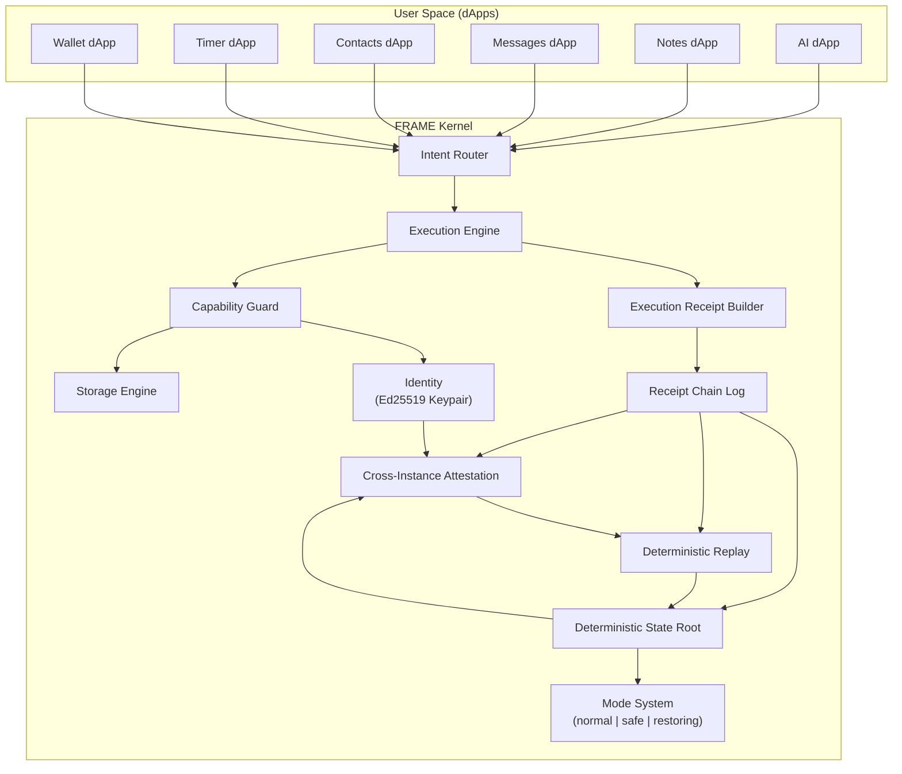
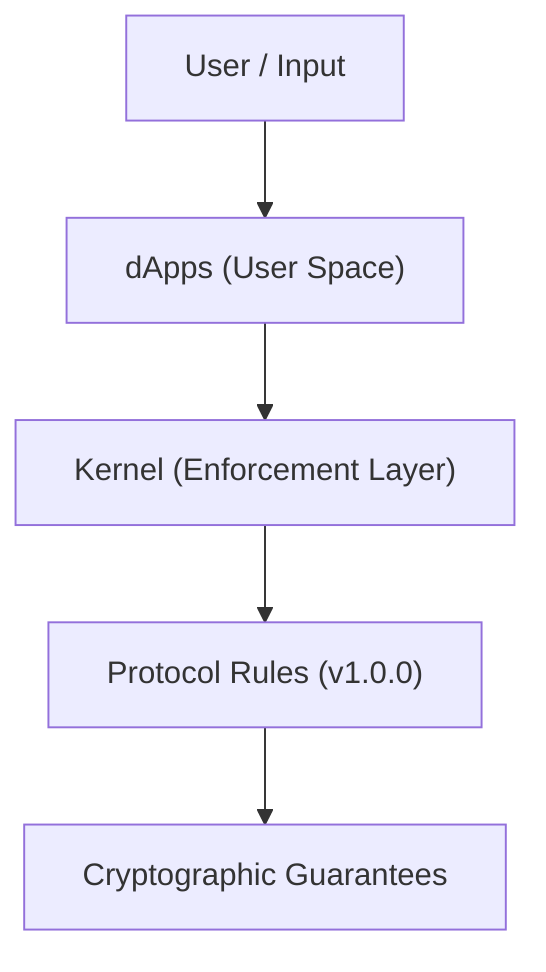

# FRAME Protocol

> A Sovereign Operating Framework for the Internet of Intelligence

## Overview
FRAME is an open protocol and sovereign system architecture for the emerging machine-driven internet. It defines a universal structure for building decentralized, AI-powered digital societies where programmable identity, logic, economy, and memory converge.

FRAME is not a product, it is a foundational architecture. It defines how dapps interact with AI agents, users, dapps, assets, and each other. It formalizes control surfaces between AI cognition, economic logic, and cryptographic authority.

Join in shaping the post-human digital operating system:
👉 https://discord.gg/k7K4FwQpyf

---
Most software today depends on centralized servers.
Your identity lives on someone else’s infrastructure.
Your data is stored remotely.
Your permissions are enforced by platforms you don’t control.

FRAME exists to invert that model.

FRAME is a local-first identity runtime.

It runs modular dApps inside a controlled execution environment bound to a cryptographic identity stored on your machine.

Each app declares the capabilities it needs.
FRAME enforces those permissions at runtime.

Every action is recorded in a signed, hash-linked log.
The system state can be derived and verified deterministically.

There is no backend service.
No external account system.
No platform-level trust assumption.

Identity, execution, storage, and integrity are unified locally.

---

## Architecture

```mermaid
flowchart TB

%% =========================
%% USER SPACE (dApps)
%% =========================

subgraph USER_SPACE["User Space (dApps)"]
    AI["AI dApp"]
    NOTES["Notes dApp"]
    MESSAGES["Messages dApp"]
    CONTACTS["Contacts dApp"]
    TIMER["Timer dApp"]
    WALLET["Wallet dApp"]
end

%% =========================
%% KERNEL
%% =========================

subgraph KERNEL["FRAME Kernel"]

    ROUTER["Intent Router"]
    ENGINE["Execution Engine"]
    GUARD["Capability Guard"]
    MODE["Mode System\n(normal | safe | restoring)"]
    STORAGE["Storage Engine"]
    IDENTITY["Identity\n(Ed25519 Keypair)"]
    RECEIPT["Execution Receipt Builder"]
    CHAIN["Receipt Chain Log"]
    STATE_ROOT["Deterministic State Root"]
    REPLAY["Deterministic Replay"]
    ATTEST["Cross-Instance Attestation"]

end

%% =========================
%% FLOW: EXECUTION
%% =========================

AI --> ROUTER
NOTES --> ROUTER
MESSAGES --> ROUTER
CONTACTS --> ROUTER
TIMER --> ROUTER
WALLET --> ROUTER

ROUTER --> ENGINE
ENGINE --> GUARD
GUARD --> STORAGE
GUARD --> IDENTITY

ENGINE --> RECEIPT
RECEIPT --> CHAIN
CHAIN --> STATE_ROOT

STATE_ROOT --> MODE

%% =========================
%% REPLAY / VERIFICATION
%% =========================

CHAIN --> REPLAY
REPLAY --> STATE_ROOT
CHAIN --> ATTEST
ATTEST --> REPLAY

%% =========================
%% EXPORT / IMPORT
%% =========================

IDENTITY --> ATTEST
STATE_ROOT --> ATTEST
```
### Protocol layers

```mermaid
flowchart TB

USER["User / Input"]
DAPPS["dApps (User Space)"]
KERNEL["Kernel (Enforcement Layer)"]
PROTOCOL["Protocol Rules (v1.0.0)"]
CRYPTO["Cryptographic Guarantees"]

USER --> DAPPS
DAPPS --> KERNEL
KERNEL --> PROTOCOL
PROTOCOL --> CRYPTO
```
---

## Development Goals
- Fully modular, chain-agnostic design
- Real-time logic surfaces and AI plugin compatibility
- Persistent semantic memory + audit trail
- Permissionless protocol-level extensibility

---

## Status
FRAME is in active development. First primitives include:
- ✅ Identity profiles with AI co-agents
- ✅ Discord integration for live intelligence coordination
- 🔄 NFTx dynamic capsule spec
- 🔄 Chain abstraction layer (multi-chain identity + logic)
- 🔄 Agent swarm protocol

---

## Links
- 🌐 Main Site: *coming soon*
- 🤖 Discord: [Join FRAME](https://discord.gg/k7K4FwQpyf)

---

## License
MIT License — see `LICENSE.md`

> FRAME is a vision protocol — a reference operating structure for digital sovereignty. It belongs to no one. It evolves through logic, not authority.
