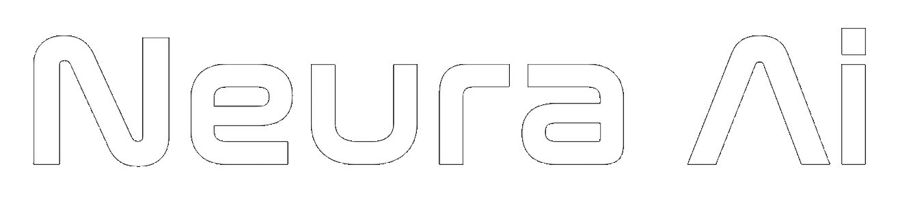

<h1 align="center">
  <sub>
    <sup>
      <sub>
        <h1 align="center" style="font-size: 10rem;">Frame</h1>
      </sub>
    </sup>
  </sub>
</h1>

<p align="center">
  <a href="https://www.google.com/" target="_blank">
    
  </a>
  &nbsp;&nbsp;
  <a href="https://chat.openai.com/?q=Explain+Frame+protocol+in+simple+terms%2C+what+it+does%2C+why+it+matters%2C+how+its+permissions+work%2C+how+the+UI+is+generated%2C+and+give+real+world+examples.+Use+this+for+full+context%3A+https://raw.githubusercontent.com/frameprotocol/docs/refs/heads/main/README.md" target="_blank">
    
  </a>
</p>

---

<div align="center">

<blockquote align="left">

<table align="center" style="border-collapse:collapse;">
  <tr>
    <th colspan="2" style="border:1px solid #999; padding:6px; text-align:center;">
      FRAME BOOTSTRAP
      <table style="border-collapse:collapse; margin-top:6px;">
        <tr>
          <td style="border:1px dashed red; padding:4px;">
            <table style="border-collapse:collapse;">
              <tr>
                <td style="border:1px dotted blue; padding:3px;">
                  ████████████████████████████████████████▓░
                </td>
              </tr>
            </table>
          </td>
          <td style="border:1px dashed red; padding:4px; text-align:center;">
            98%
          </td>
        </tr>
      </table>
    </th>
  </tr>
</table>


<p align="center">⟡ deterministic runtime almost synced... ⟡</p>

</blockquote>

</div>

```python
Hardware
  ↓
FRAME Microkernel
  ↓
FRAME System Services
  ↓
FRAME Runtime
  ↓
FRAME UI
```

| Runs Anywhere standalone/localfirst | Core System Pieces |
|----------------------------------|-------------------|
| • runs standalone on bare metal | • intent parsing |
| • runs as its own bootable OS | • capability enforcement |
| • runs inside a VM (KVM / QEMU / VirtualBox) | • deterministic execution |
| • runs inside a microVM (Firecracker-style) | • sandbox isolation |
| • runs inside a container (Docker / OCI) | • state management |
| • runs headless as a daemon | • receipt generation |
| • runs as a CLI entrypoint | • signature + identity |
| • runs as a desktop UI environment | • storage (canonical JSON) |
| • runs embedded (edge / device / vehicle) | • state root hashing |
| • runs over network as a remote node | • replay engine |
| • runs peer-to-peer across multiple nodes | • fast UI synthesis |
| • runs inside a browser runtime (WASM) | • layout engine |
| • runs inside another FRAME instance | • dApp routing |
| • runs as a nested deterministic sandbox | • service orchestration |
| • runs replicated across distributed systems | • driver abstraction |
| • runs self-contained with no external dependencies | • networking layer |
|  | • memory control |
|  | • governance layer |
|  | • audit + verification |
|  | • self-maintenance agents |


> [!CAUTION]
> **Core Control & Execution**
>
> programmable UI commands  
> deterministic dApp execution  
> symbol-driven intent routing  
> composable intent primitives (<SEARCH_IMAGES> + <WEATHER>)  
> internal compact intent encoding ({ i, e } format)  
> structured intent normalization layer  
> unified action surface (no special-case buttons)  
> replacing commands with structure  
> deterministic front-end behavior independent of model quirks  
>
> **Agent & Protocol Systems**
>
> agent-to-agent protocols  
> low-token control systems  
> hybrid natural language + control language interaction  
> symbol token protocol extensibility  
> future vector/latent control compatibility  
> internal control language evolution without UI change  
> UI-level protocol abstraction over model behavior  
> possibility of training models on your symbolic protocol  
> eventual agent-to-agent communication without language  
> cross-dApp orchestration via shared intent schema  
> distributed dApp ecosystems with consistent control language  
> plug-and-play AI modules using shared symbol protocol  
>
> **UI Intelligence & Adaptation**
>
> real-time intent locking during typing  
> predictive UI reconfiguration based on input  
> automatic dApp surfacing before execution  
> context-aware action injection  
> dynamic action ranking tied to intent confidence  
> UI-assisted intent disambiguation  
> relevance-driven interface layout (not static UI)  
> dynamic UI restructuring per keystroke  
> predictive execution pathways  
> progressive disclosure of system capability (actions appear only when relevant)  
> replacing menus with relevance surfaces  
> replacing navigation with inference  
> replacing UI state with computed state  
> replacing user effort with system anticipation
>
> **Interaction Model & UX**
>
> gesture-based system control (tap / hold / drag differentiation)  
> contextual action spawning via hold-release  
> spatial UI as a reasoning surface  
> active card as execution anchor  
> passive/context/active zoning for cognitive load control  
> multi-mode interaction without explicit mode switching  
> stateful interaction without UI complexity  
> implicit workflow transitions (chat → create → edit seamlessly)  
> unified surface rendering (no hidden UI modes)
>
> **dApp System & Extensibility**
>
> dApp creation through natural language  
> dApp mutation through natural language  
> self-modifying interface components  
> recursive tool editing (edit the tool that edits tools)  
> edit-as-a-mode (not a separate tool)  
> create-as-a-mode (programmable system expansion)  
> composable dApp ecosystem (actions → dApps → meta-dApps)  
> removal of hardcoded UI controls (everything becomes a dApp)  
> local AI operating surface (not just a chat UI)
>
> **Memory & Context Systems**
>
> timeline-as-dApp (history as a first-class entity)  
> memory-aware interaction surfaces (timeline integration)  
> fallback-safe rendering (every output becomes visible)  
> ephemeral vs persistent surface separation  
> consistent cross-flow execution behavior (no silent failures)
>
> **System Architecture Direction**
>
> intent-first interface instead of text-first interface  
> reduction of ambiguity before execution  
> internal protocol that can outlive any specific model  
> transition toward intent-native computing  
> merging of IDE + chat + operating system paradigms  
> replacing apps with intent-driven execution  
> collapsing frontend/backend boundary into one loop  
> UI as a programmable substrate, not a static interface  
> interface behaving like a reasoning system, not a tool
>
> **Future / Advanced Capabilities**
>
> foundation for autonomous UI systems  
> self-organizing interface layouts  
> adaptive workflows based on user behavior  
> action suggestion as a first-class system primitive  
> groundwork for FRAME-style runtime integration  
> agent reasoning guided by UI state (ui_state injection)  
> UI acting as a constraint system for the agent  
> foundation for full UI ↔ agent feedback loop  
> eventual emergence of self-evolving UI behavior  

---

# Notable Achievements
* Deterministic intent execution engine
* Capability based security model
* Cryptographically verifiable receipts
* Replayable and attestable state transitions
* Federated synchronization with trust controls
* Snapshot import/export with integrity verification
* Fully sandboxed execution environment
* Comprehensive invariant enforcement

*Sovereign runtime capable of supporting verifiable decentralized applications.*


---

| Repo | What is it? | Status | Completion |
| - | - | - | - |
| `Frame` | Local system with identity, encrypted storage, apps, p2p networking, capability permissions, deterministic execution, signed logs, replayable state, composable dapps, and full user control | ⏳wip | 85% |
| `Intent model trainer` | Teaches a model to convert natural language input into structured `{intent, params}` outputs without reasoning or execution logic | ✅ | 97% |
| *`Intent schema language`*  | A rule based parser that converts simple natural language into Frame compatible interlang commands using fixed grammar and pattern matching | ⚠️ Archived | 100% |
| `Documents` | Everything explained in markdown readme format & A react site for easier explanations in part with ai question to answer intergration & dapp builder | ✅ | 33% |

See `Documents` for detailed explanations.

---

> Frame is a local, deterministic runtime for applications. It executes user intents through a capability constrained execution engine, producing cryptographically signed receipts that enable verifiable state reconstruction and integrity verification.

Instead of apps mutating state directly, the system processes intents through a deterministic kernel that:
- Resolves intents to dApps
- Executes dApps inside a capability scoped APIs
- Records executions as cryptographically linked receipts
- Derives a deterministic state root from execution

All application behavior is verifiable, replayable, and deterministic.

Join in shaping the post human digital operating system:
Can Use this centulized service messanging platform for web2lense👉 https://discord.gg/k7K4FwQpyf (I wouldnt trust it)
Rebuild the internet to be logically healthy, change the world.

## License
MIT License — see `LICENSE.md`

> FRAME is a vision protocol — a reference operating structure for digital sovereignty. It belongs to no one. It evolves through logic, not authority.
